# 基本语法

PlantUML 文件以 .puml 为后缀，我们只需新建一个 .puml 文件即可。对于 .puml 文件而言，其格式以 @startuml 开始，以 @enduml 结束，还可以使用 title 设置 UML 图的标题，用 ' 单引号插入代码注释。一个基本的 PlantUML 图的代码框架如下所示：

  

```plant-uml

@startuml
title: 标题
' 注释（用一个单引号标识）
' UML 图逻辑
@enduml

```

```plantuml

@startuml
title: 标题
' 注释（用一个单引号标识）
' UML 图逻辑
@enduml

```

  



  

不同类型的 UML 图语法不同，建议用到对应 UML 图的时候去翻阅 [PlantUML 官网](https://plantuml.com/zh/)，现学现用效率最高了，没必要强行记住。