# 活动图

  

活动图 (Activity Diagram)

(新语法)

  

## 简单活动图

  

活动标签(activity label)以冒号开始，以分号结束。

  

文本格式支持creole wiki语法。

  

活动默认按照它们定义的顺序进行自动连接。

  

```plant-uml

@startuml

:Hello world;

:This is defined on

several **lines**;

@enduml

```

  

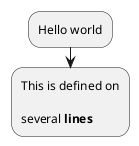

  

## 开始/停止/结束

  

你可以使用`start`和`stop`关键字来表示一个图的开始和结束。

  

```plant-uml

@startuml

start

:Hello world;

:This is defined on

several **lines**;

stop

@enduml

```

  

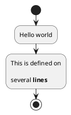

  

你也可以使用`end`关键字。

  

```plant-uml

@startuml

start

:Hello world;

:This is defined on

several **lines**;

end

@enduml

```

  

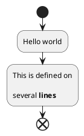

  

## 条件(if)

  

你可以使用`if`,`then`,`break`和`else`关键词来在你的图表中放入测试。 标签可以用圆括号提供。

  

有3种语法可供选择:

  

- `if (...) then (...)`

  

```plant-uml

@startuml

  

start

  

if (Graphviz installed?) then (yes)

:process all\ndiagrams;

else (no)

:process only

__sequence__ and __activity__ diagrams;

endif

  

stop

  

@enduml

```

  

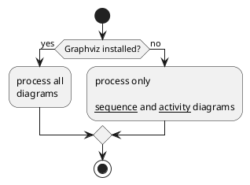

  

- `if (...) is (...) then`

  

```plant-uml

@startuml

if (color?) is (<color:red>red) then

:print red;

else

:print not red;

@enduml

```

  

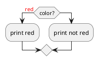

  

- `if (...) equals (...) then`

  

```plant-uml

@startuml

if (counter?) equals (5) then

:print 5;

else

:print not 5;

@enduml

```

  

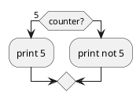

- `if (...) then (...) elseif (...) then (...) else (...)`

  

```plant-uml

@startuml

start

if (condition A) then (yes)

:Text 1;

elseif (condition B) then (yes)

:Text 2;

stop

(no) elseif (condition C) then (yes)

:Text 3;

(no) elseif (condition D) then (yes)

:Text 4;

else (nothing)

:Text else;

endif

stop

@enduml

```

  

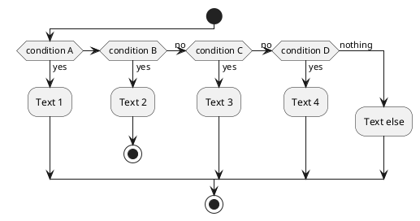

  

`!pragma useVerticalIf on` 用于设置垂直显示条件语句。

  

```plant-uml

@startuml

!pragma useVerticalIf on

start

if (condition A) then (yes)

:Text 1;

elseif (condition B) then (yes)

:Text 2;

stop

elseif (condition C) then (yes)

:Text 3;

elseif (condition D) then (yes)

:Text 4;

else (nothing)

:Text else;

endif

stop

@enduml

```

  

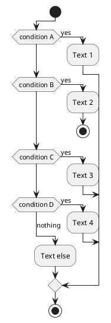

  

可以在if判断中终止一个行为.

  

```plant-uml

@startuml

if (条件?) then

:错误;

stop

endif

#palegreen:行为;

@enduml

```

  

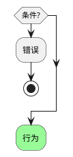

  

但如果你想在特定行为上停止，你可以使用`kill`或`detach`关键字:

  

- `kill` 用于终止当前行为

  

```plant-uml

@startuml

if (条件?) then

#pink:错误;

kill

endif

#palegreen:行为;

@enduml

```

  

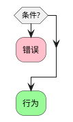

  

- `detach` 用于终止当前行为并且不返回

  

```plant-uml

@startuml

if (条件?) then

#pink:错误;

detach

endif

#palegreen:行为;

@enduml

```

  


  

## 选择(switch)

  

你可以使用`switch`,`case`和`endswitch`关键词在图表中绘制Switch判断.

  

使用括号表示标注.

  

```plant-uml

@startuml

start

switch (测试?)

case ( 条件 A )

:Text 1;

case ( 条件 B )

:Text 2;

case ( 条件 C )

:Text 3;

case ( 条件 D )

:Text 4;

case ( 条件 E )

:Text 5;

endswitch

stop

@enduml

```

  

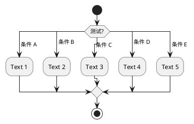

  

## 重复循环(repeat)

  

你可以使用关键字`repeat`和`repeatwhile`进行重复循环。

  

```plant-uml

@startuml

  

start

  

repeat

:读取数据;

:生成图片;

repeat while (更多数据?)

  

stop

  

@enduml

```

  

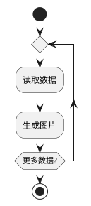

  

你同样可以使用一个全局行为作为`repeat`目标， 在返回循环开始时使用`backward`关键字插入一个全局行为。

  

```plant-uml

@startuml

  

start

  

repeat :foo作为开始标注;

:读取数据;

:生成图片;

backward:这是一个后撤行为;

repeat while (更多数据?)

  

stop

  

@enduml

```

  

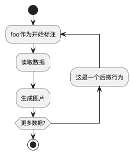

  

你可以使用`break`关键字跟在循环中的某个行为后面打断循环.

  

```plant-uml

@startuml

start

repeat

:测试某事;

if (发生错误?) then (没有)

#palegreen:好的;

break

endif

->not ok;

:弹窗 "文本过长错误";

repeat while (某事发生文本过长错误?) is (是的) not (不是)

->//合并步骤//;

:弹窗 "成功！";

stop

@enduml

```

  

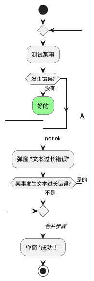

  

## Goto和标签处理

  

可以使用`label`和`goto`关键词来表示Goto处理，其中：

  

- `label <label_name>`

- `goto <label_name>`

  

```plant-uml

@startuml

title Point two queries to same activity\nwith `goto`

start

if (Test Question?) then (yes)

'space label only for alignment

label sp_lab0

label sp_lab1

'real label

label lab

:shared;

else (no)

if (Second Test Question?) then (yes)

label sp_lab2

goto sp_lab1

else

:nonShared;

endif

endif

:merge;

@enduml

```

  

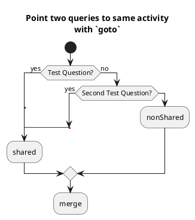

  

## 循环(while)

  

可以使用关键字`while`和`endwhile`进行while循环。

  

```plant-uml

@startuml

  

start

  

while (data available?)

:read data;

:generate diagrams;

endwhile

  

stop

  

@enduml

```

  

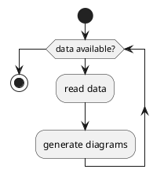

  

还可以在关键字`endwhile`后添加标注，还有一种方式是使用关键字`is`。

  

```plant-uml

@startuml

while (check filesize ?) is (not empty)

:read file;

endwhile (empty)

:close file;

@enduml

```

  

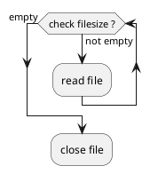

  

如果你使用`detach`来形成一个无限循环, 那么你可能需要使用`-[hidden]->`来隐藏一些不完整的箭头。

  

```plant-uml

@startuml

:Step 1;

if (condition1) then

while (loop forever)

:Step 2;

endwhile

-[hidden]->

detach

else

:end normally;

stop

endif

@enduml

```

  

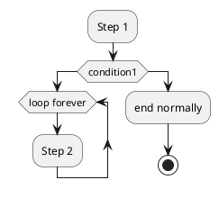